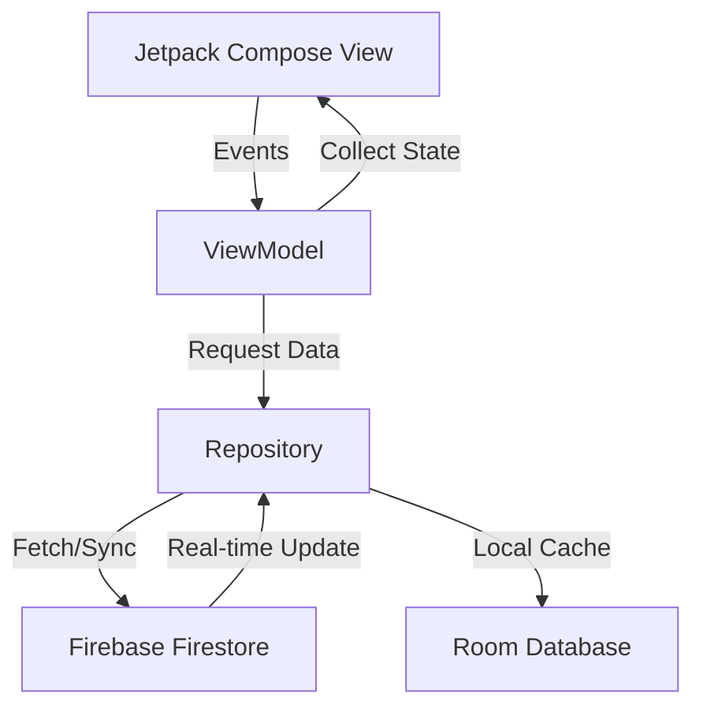

# Technical Architecture & Design Patterns - KBK

This document provides a deep dive into the technical structure of KBK. Use this to understand the "Why" and "How" behind the codebase.

## 1. High-Level Architectural Pattern: Clean Architecture + MVVM

KBK follows **Clean Architecture** principles to ensure the code is scalable, testable, and independent of external libraries.

### The 3 Layers:
1.  **Presentation Layer (UI):** 
    -   **Jetpack Compose:** Declarative UI components.
    -   **ViewModel:** Holds UI state and handles logic using `StateFlow`.
2.  **Domain Layer (Business Logic):**
    -   **Models:** Pure Kotlin data classes (User, Room, TimetableSlot).
    -   **Repository Interfaces:** Defines *what* data operations are needed without caring *how* they are done.
    -   **UseCases:** Specific business rules (e.g., `ValidateUserIdentityUseCase`).
3.  **Data Layer (Implementation):**
    -   **Firebase/Room:** Concrete implementations of repositories.
    -   **DAOs & Entities:** Local database access logic.

---

## 2. Design Patterns Implemented

### A. Repository Pattern
Used to provide a clean API for data access to the rest of the application. It acts as a mediator between different data sources (Firestore vs. Room).
-   **Files:** `AuthRepositoryImpl`, `RoomRepositoryImpl`.

### B. Singleton Pattern
Managed via **Hilt (Dagger)**. Database instances and repository implementations are provided as Singletons to ensure efficient resource usage.
-   **Files:** `AppModule.kt`.

### C. Observer Pattern (Reactive Streams)
The UI "observes" changes in the data layer using **Kotlin Coroutines & Flow**. When a value in Firestore changes, the UI updates automatically without a page refresh.
-   **Files:** `DashboardViewModel.kt`, `MainViewModel.kt`.

### D. Component-Based UI
Custom Brutalist components are built as reusable atoms.
-   **Files:** `BrutalistComponents.kt`.

---

## 3. Data Flow Diagram (Conceptual)

---

## 4. Directory Structure Explanation

### `com.example.kiskibreakkab`
-   **`core/`**: Shared utilities and the foundation.
    -   `theme/`: Dynamic Light/Dark theme logic and Brutalist colors.
    -   `components/`: Reusable 3D buttons, cards, and input fields.
    -   `utils/`: Time management (`TimeUtils`) and Background Workers (`FriendStatusWorker`).
-   **`domain/`**: The "Heart" of the app.
    -   `model/`: Pure data structures used by all layers.
    -   `repository/`: Interfaces that define data behavior.
-   **`data/`**: The "Muscle" of the app.
    -   `local/`: Room database setup, entities, and DAOs for offline support.
    -   `repository/`: Firebase logic and data-sync implementations.
-   **`presentation/`**: The "Face" of the app.
    -   Each feature (Auth, Dashboard, Timetable, RoomFinder) has its own sub-folder containing the `Screen` (View) and the `ViewModel`.
-   **`di/`**: Hilt modules that glue everything together (`AppModule.kt`).

---

## 5. Key Highlights for Interviewers

-   **Offline-First Sync:** Data is cached in Room for instant loading and synced with Firestore for real-time social features.
-   **Scalable DI:** Hilt makes the app modular; swapping Firebase for a REST API would only require changing the `AppModule`.
-   **Tactical Reliability:** WorkManager ensures "Friend Free" checks run even when the app is closed, providing true background intelligence.
-   **Security:** UID uniqueness and Email-prefix matching are enforced at the UseCase level, separate from the UI.
